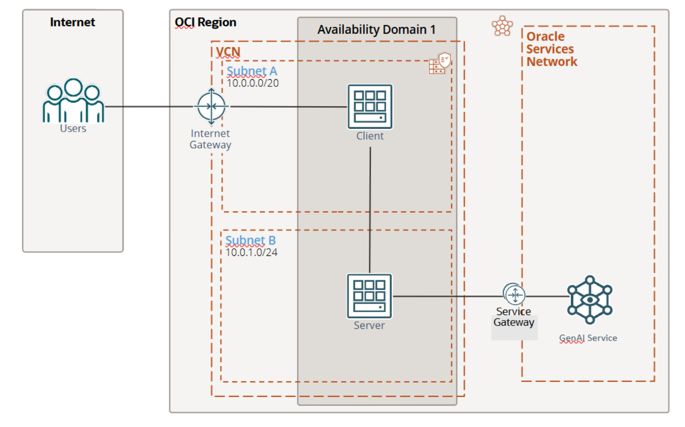

# OCI GenAI Automatic Content Extractor & Summarizer

[](https://img.shields.io/badge/license-UPL-green) [](https://sonarcloud.io/dashboard?id=oracle-devrel_oci-content-summary)


## Introduction

This project retrieves the 25 trending projects from a day (from [here](https://github.com/trending)), reads their README.md files, and summarizes them in a way which is ready for social media.

Companies can use this in their content generation pipeline strategies, or individuals can use it when trying to grow their social media following with organic and up-to-date content!

These are the LLM hyperparameters used for generating the summary:

- Prompt: "You are an expert AI researcher. Generate an abstractive summary of the given Markdown contents. Share an interesting insight to captivate attention. Here are the contents: <CONTENTS>"
- Maximum number of tokens to generate: 550
- Temperature (creativeness in generating the response): 1.0 (100%). The lower the temperature, the more consistent and less wild/imaginative generations are
- Frequency penalty (penalize generating repeated text): 0.0 (0%)
- Top p (use the p% most common words in the selected language): 0.75 (75%)

You can easily switch between multiple LLMs offered through the OCI Generative AI Service, simply by modifying the `model_id` variable in `summarize_llm.py`. Here are the currently supported models, including the newest `Llama 3.1` model:


- `cohere.command-r-16k`: A versatile model for general language tasks like text generation, summarization, and translation, with a context size of **16K tokens**. Ideal for building conversational AI with a good balance of performance and cost-effectiveness.
- `cohere.command-r-plus`: An enhanced version with more sophisticated understanding and deeper language capabilities. Best for complex tasks requiring nuanced responses and higher processing capacity.
- `meta.llama-3.1-70b-instruct`: A 70B parameter model with **128K token** context length and multilingual support.
- `meta.llama-3.1-405b-instruct`: The largest publicly available LLM (**405B** parameters) with exceptional capabilities in reasoning, synthetic data generation, and tool use. Best for enterprise applications requiring maximum performance.

Check out the demo [here](https://www.youtube.com/watch?v=qiUjqxyqY0I&list=PLPIzp-E1msraY9To-BB-vVzPsK08s4tQD&index=4)

## Getting Started

### 0. Prerequisites and setup

- Oracle Cloud Infrastructure (OCI) Account - [sign-up page](https://signup.cloud.oracle.com/)
- [Oracle Cloud Infrastructure (OCI) Generative AI Service - Getting Started with Generative AI](https://docs.oracle.com/en-us/iaas/Content/generative-ai/getting-started.htm)
- [Oracle Cloud Infrastructure Documentation - Generative AI](https://docs.oracle.com/en-us/iaas/Content/generative-ai/home.htm)
- [Oracle Cloud Infrastructure (OCI) Generative AI Service SDK - Oracle Cloud Infrastructure Python SDK](https://pypi.org/project/oci/)
- [Python 3.10](https://www.python.org/downloads/release/python-3100/)
- [Conda](https://conda.io/projects/conda/en/latest/user-guide/install/index.html)
- [OCI SDK](https://docs.oracle.com/en-us/iaas/Content/API/Concepts/sdkconfig.htm)

Follow these links below to generate a config file and a key pair in your ~/.oci directory:

- [SDK Config](https://docs.oracle.com/en-us/iaas/Content/API/Concepts/sdkconfig.htm)
- [API Signing Key](https://docs.oracle.com/en-us/iaas/Content/API/Concepts/apisigningkey.htm)
- [SDK CLI Installation](https://docs.oracle.com/en-us/iaas/Content/API/SDKDocs/cliinstall.htm#configfile)

After completion, you should have following 2 things in your ~/.oci directory:

- A `config` file
- A key pair named `oci_api_key.pem` and `oci_api_key_public.pem`
- Now make sure you change the reference of key file in config file (where key file point to private key: `key_file=/YOUR_OCI_CONFIG_DIR/oci_api_key.pem`)

Then, we're going to configure a new file, called `config.yaml` that contains this structure, which will allow you to authenticate to OCI and call the OCI GenAI summarization model, to summarize the content from each project's README files:

1. Copy `config_example.yaml` to `config.yaml`:

```bash
cp config_example.yaml config.yaml
```

2. Update the following values in your `config.yaml`:

- `compartment_id`: Your OCI compartment OCID
- `config_profile`: Your OCI CLI profile name (usually "DEFAULT")
- `db_username`: Your database username (default is "ADMIN")
- `db_password`: Your database user's password
- `db_dsn`: Your database connection string, which includes:
  - host: Your database hostname (e.g., "adb.us-ashburn-1.oraclecloud.com")
  - service_name: Your database service name
  - port: Database port (usually 1522)

3. This is an example database connection string format:

```yaml
db_dsn: "(description= (retry_count=5)(retry_delay=2)(address=(protocol=tcps)(port=1522)(host=adb.region.oraclecloud.com))(connect_data=(service_name=your_db_name_high.adb.oraclecloud.com))(security=(ssl_server_dn_match=yes)))"
```

> **Note**: You can find your oci configuration in `~/.oci/config`. Make sure you have previously installed [OCI SDK in your computer](https://docs.oracle.com/en-us/iaas/Content/API/Concepts/sdkconfig.htm).

Finally, we install Python dependencies:

```sh
pip install -r requirements.txt
```

## 1. Automatically running everything

You can run the bash script to generate all outputs in the `output/` dir:

```bash
chmod a+x run.sh # if you don't have exec permissions initially for the .sh file
./run.sh
```

## 2. (Optional) Running each component step-by-step

```sh
scrapy runspider trending_spider.py # this will get trending repositories
scrapy runspider info_spider.py # then, for each trending repository, it will extract info.
python main.py # to process their README.md files as well, and runs a summarizer on top of it, and insert these into an autonomous database.
```

## Appendix: Getting Started with LinkedIn Poster

Note that the described resources in this annex are unofficial, as LinkedIn does not have an official API to publish, and this process has to be emulated with a 3-legged access token using their Developer Portal. This part is **experimental** and you should probably look for a more robust way to automate publishing to social media - still, if you're interested in how this 3-legged access token can be used, here are the steps:

1. Create or use an existing developer application from the [LinkedIn Developer Portal](https://www.linkedin.com/developers/apps/)
2. Request access to the Sign In With LinkedIn API product. This is a self-serve product that will be provisioned immediately to your application.
3. Generate a 3-legged access token using the Developer Portal [token generator tool](https://www.linkedin.com/developers/tools/oauth/token-generator), selecting the `r_liteprofile` scope.

## Physical Architecture



## Notes/Issues

None at this moment.

## URLs

- [Oracle AI](https://www.oracle.com/artificial-intelligence/)
- [AI for Developers](https://developer.oracle.com/technologies/ai.html)

## Contributing

This project is open source. Please submit your contributions by forking this repository and submitting a pull request! Oracle appreciates any contributions that are made by the open source community.

## License

Copyright (c) 2024 Oracle and/or its affiliates.

Licensed under the Universal Permissive License (UPL), Version 1.0.

See [LICENSE](LICENSE) for more details.

ORACLE AND ITS AFFILIATES DO NOT PROVIDE ANY WARRANTY WHATSOEVER, EXPRESS OR IMPLIED, FOR ANY SOFTWARE, MATERIAL OR CONTENT OF ANY KIND CONTAINED OR PRODUCED WITHIN THIS REPOSITORY, AND IN PARTICULAR SPECIFICALLY DISCLAIM ANY AND ALL IMPLIED WARRANTIES OF TITLE, NON-INFRINGEMENT, MERCHANTABILITY, AND FITNESS FOR A PARTICULAR PURPOSE.  FURTHERMORE, ORACLE AND ITS AFFILIATES DO NOT REPRESENT THAT ANY CUSTOMARY SECURITY REVIEW HAS BEEN PERFORMED WITH RESPECT TO ANY SOFTWARE, MATERIAL OR CONTENT CONTAINED OR PRODUCED WITHIN THIS REPOSITORY. IN ADDITION, AND WITHOUT LIMITING THE FOREGOING, THIRD PARTIES MAY HAVE POSTED SOFTWARE, MATERIAL OR CONTENT TO THIS REPOSITORY WITHOUT ANY REVIEW. USE AT YOUR OWN RISK.
